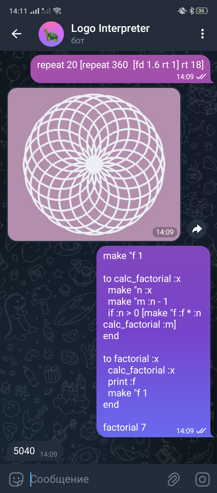

Logo is a programming language designed in 1967. It introduced turtle graphics, widely used to teach kids programming.

This project is an implementation of a minimalist but Turing-complete Logo-like programming language, with interpreter that works right in Telegram.

Currently, these procedures are implemented:
 - backward
 - forward
 - right
 - left
 - penup
 - pendown
 - repeat
 - make
 - if
 - to
 - clean
 - home
 - clearscreen
 - hideturtle
 - showturtle
 - setheading
 - print
